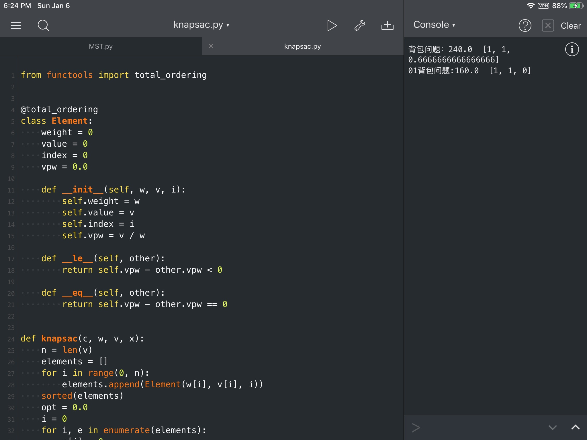
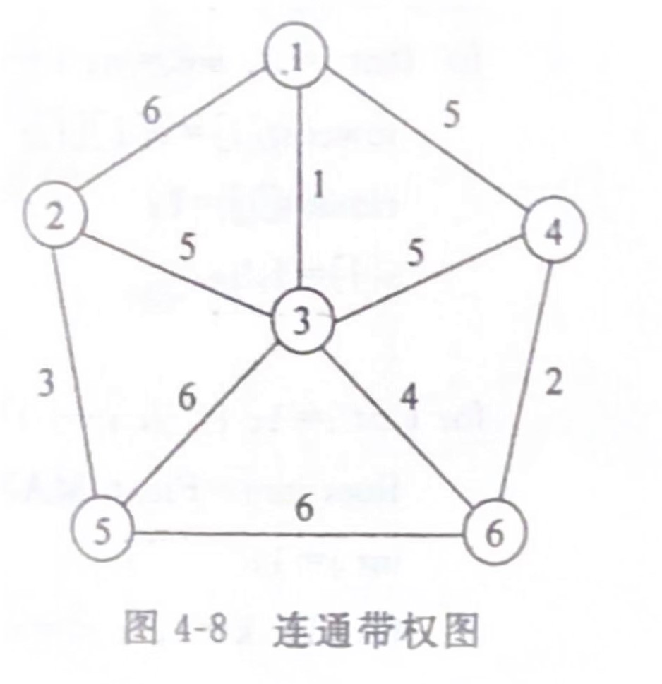
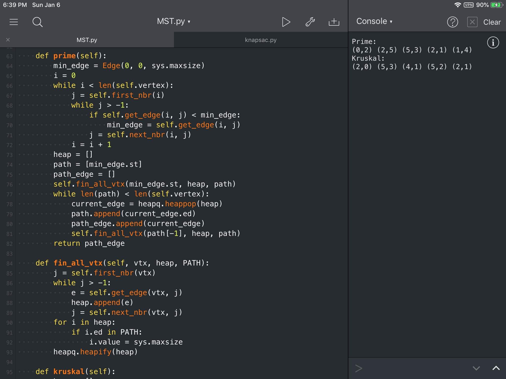

# 贪心算法
###  一、问题描述
1. 0-1背包问题
	- 给定n种物品和一个背包，物品i的重量是 $w_i$ ，其价值为 $v_i$ ，背包的容量为C。如何选择装入背包的物品使得装入背包中物品的总价值最大。
	- $C<0,w_i>0,v_i>0,1\leq i\leq n$ 要求找出一个n元0-1向量 $(x_1,x_2,...,x_n),x_i\in \{0,1\},i \leq i\leq n$ ，使得 $\sum_{i=1}^{n}w_ix_i\leq C$,并且 
   $\sum_{i=1}^{n}v_ix_i$ 达到最大
   
2. 背包问题
	- 与0-1背包问题类似，所不同的是在选择物品i装入背包时，可以选择物品i的一部分，而不一定要全部装入背包， $i\leq i\leq n$
	- $C>0,w_i>0,v_i>0,i\leq i\leq n$ 要求找出一个n元向量 $(x_1,x_2,...,x_n),0\leq x_i\leq 1,1\leq i\leq n$ ，使得 $\sum_{i=1}^{n}w_ix_i\leq C$,并且 
   $\sum_{i=1}^{n}v_ix_i$ 达到最大
	
3. 最小生成树问题
	- 设G=(V,E)是无向连通带权图，即一个网络。E中每条边(v,w)的权为c[v][w]。如果G的子图G’是一颗包含G的所有顶点的树，则称G’为G的生成树。生成树上各边权的总和称为该生成树的耗费。在G的所有生成树中，耗费最小的生成树称为G的最小生成树。

### 二、问题分析
1. 0-1背包问题
	- 设A是能够装入容量为C的背包的具有最大价值的物品集合，则 $A_j=A- \{j\}$ 是n-1个物品1,2,...,j-1,j+1,n可装入容量为 $C-w_j$ 的背包的具有最大价值的物品集合。0-1背包问题虽然具有最优子结构的性质，但是由于无法保证最终能够将背包装满，贪心策略并不能求出0-1背包问题的最优解。这部分闲置的背包空间使每公斤背包空间的价值降低了。事实上在考虑0-1背包问题时，应比较选择该物品和不选择该物品所导致的最终方案，然后再作出最好的选择。
2. 背包问题
	- 若背包问题的一个最优解包含物品j，则从该最优解中拿出所含的物品j的那部分重量w，剩余的将是n-1个原重物品1,2,...,j-1,j+1,...,n以及重为 $w_j-w$ 的物品j中可装入容量为C-w的背包且具有最大价值的物品
	- 求解背包问题的基本步骤是，首先计算没中物品单位重量的价值 $\frac{v_i}{w_i}$ ，然后依据贪心选择策略，将尽可能多的单位重量价值最高的物品装入背包，若将这种物品全部装入背包后，背包内的物品总重量为超过C，则选择单位重量价值次高的物品并尽可能装入，直到背包装满为止。
3. 最小生成树问题
	- Prime算法
		- 设G=(V,E)是连通带权图，V={1,2,...,n}。构造G的最小生成树的Prim算法的基本思想是：首先置S={1}，然后只要S是V的真子集，就进行如下贪心选择：选取满足条件 $i\in S,j\in V-S$ ，且c[i][j]最小的边，将顶点j添加到S中。这个过程一直进行到S=V时为止。在这个过程中选取到的所有边恰好构成G的一棵最小生成树。
		- 上述算法结束时，T中包含G的n-1条边。利用最小生成树性质和数学归纳法容易证明，上述算法中边集合始终包含G的某刻最小生成树中的边。因此，在算法结束时，T中的所有边构成G的一棵最小生成树。
	- Kruskal算法
		- 首先将G的n个顶点看成n个孤立的连通分支。将所有的边按权从小到大排序，然后从第一条边开始，依边权递增的顺序查看每一条边，并按下述方法连接两个不同的连通分支：
			1. 当查看到第k条边(v,w)时，如果端点v和w分别是当前两个不同不同连通分支T1和T2中的顶点时，就用边(v,w)将T1和T2连接成一个连通分支。
			2. 如果端点v和w在当前的同一个连通分支中，就直接再查看第k+1条边。
		- 这个过程一直持续到只剩下一个连通分支为止。此时这个连通分支就是G的一棵最小生成树。

三、算法流程

| 变量名 | 含义 |
|:--:|:--:|
| opt | 最优解的总价值 |
| elements | 包含所有物品的列表 |
| c | 剩余容量 |
| x | 最优解向量 |

1. 0-1背包问题

```flow
st=>start: 开始
ed=>end: 结束

SortElements=>operation: 将列表elements以价格降序排列
Cond4OuterLoop=>condition: e是列表中的最后一个元素吗
CondCheckSacFull=>condition: 如果加入全部物品e，背包是否会满
OpSacNotFull=>operation: 将物品e全部装入背包并更新价值和当前重量

st->SortElements->Cond4OuterLoop
Cond4OuterLoop(no,lef)->CondCheckSacFull
CondCheckSacFull(no)->OpSacNotFull->Cond4OuterLoop
CondCheckSacFull(yes)->Cond4OuterLoop
Cond4OuterLoop(yes)->ed
```
2. 背包问题


```flow
st=>start: 开始
ed=>end: 结束

SortElements=>operation: 将列表elements以单价降序排列
Cond4OuterLoop=>condition: e是列表中的最后一个元素吗
CondCheckSacFull=>condition: 如果加入全部物品e，背包是否会满
OpSacNotFull=>operation: 将物品e全部装入背包并更新价值和当前重量

CondCheckSacStillRemains=>condition: 背包仍有空间剩余
Op2FullSac=>operation: 选取单价最高的部分填满背包剩余空间

st->SortElements->Cond4OuterLoop
Cond4OuterLoop(no)->CondCheckSacFull
CondCheckSacFull(no)->OpSacNotFull
CondCheckSacFull(yes)->CondCheckSacStillRemains
Cond4OuterLoop(yes)->CondCheckSacStillRemains
CondCheckSacStillRemains(yes)->Op2FullSac->ed
```

| 变量名 | 含义 |
|:--:|:--:|
| heap | 以边权为键的最小堆 |
| path | 最小生成树结果路径所经过的顶点列表（有序） |
| path_edge | 最小生成树结果路径列表 |
| current_edge | 当前考虑的边 |
| union_branch | 连通分支列表 |

3. Prime算法
```flow
St=>start: 开始
Ed=>end: 结束
OpFindMinEdge=>operation: 找到图中的最小边并把顶点
中的一个加入path列表
OpFindAllVtx=>operation: 找到所有与上一个加入顶点相连的边，
加入heap，
然后在heap中删除所有末端在path中的边
CdEndLoop=>condition: path中是否已包含所有顶点
OpInsideLoop=>operation: 将current_edge更新为最小堆顶，
将current_edge和其末端分别加入path_edge和path

St->OpFindMinEdge->OpFindAllVtx->CdEndLoop
CdEndLoop(no,left)->OpInsideLoop->OpFindAllVtx->CdEndLoop
CdEndLoop(yes)->Ed
```
4. Kruskal算法 
```flow
St=>start: 开始
Ed=>end: 结束

OpPrepare=>operation: 将所有边加入最小堆heap中
所有顶点各自为单独列表（一维）
加入union_branch列表（二维）
CdComplete=>condition: 当前是否还存在大于一个连通分支
OpUpdateCrtEdge=>operation: 更新current_edge为最小堆heap顶端边
CdBranch=>condition: current_edge顶点是否属于同一个连通分支
OpCombine=>operation: 合并这两个连通分支并将这条边加入edge_path

St->OpPrepare->CdComplete
CdComplete(no)->Ed
CdComplete(yes)->OpUpdateCrtEdge->CdBranch
CdBranch(no)->OpCombine->CdComplete
CdBranch(yes)->CdComplete

```

###  四、实验结果

1. 0-1背包和背包问题

   在测试程序中，我给定的测试数据为

   ```python
   c = 50
   w = [10, 20, 30]
   v = [60, 100, 120]
   x = [0] * 3
   ```

   程序给出的输出如下图
   经过验证，背包问题在使用贪心策略解决时可以得到最优解，但对于测试数据，贪心策略并没有	给出0-1背包问题的最优解

2. 最小生成树问题

   在测试程序中，我给出的输出是课本上101页图4-8所给出的图

   由于我编写的程序使用了邻接矩阵表示边，在计算机中用下标0开始计数更为自然，所以在输入实验数据的时候，每个结点的编号都相应的减去了1.这个图在程序中表示出来如下：

   ```python
   v = [0, 1, 2, 3, 4, 5]
   nul = sys.maxsize
   e = [
       [nul, 6, 1, 5, nul, nul],
       [6, nul, 5, nul, 3, nul],
       [1, 5, nul, 5, 6, 4],
       [5, nul, 5, nul, nul, nul, 2],
       [nul, 3, 6, nul, nul, 6],
       [nul, nul, 4, 2, 6, nul]
   ]
   ```

   其中nul表示不连通，运行结果如下图： 

   经过验证，输出的路径次序与书本上给出的例子完全一致。

### 五、源代码
1. 0-1背包和背包问题
```python
from functools import total_ordering


@total_ordering
class Element:
    weight = 0
    value = 0
    index = 0
    vpw = 0.0

    def __init__(self, w, v, i):
        self.weight = w
        self.value = v
        self.index = i
        self.vpw = v / w

    def __le__(self, other):
        return self.vpw - other.vpw < 0

    def __eq__(self, other):
        return self.vpw - other.vpw == 0


def knapsac(c, w, v, x):
    n = len(v)
    elements = []
    for i in range(0, n):
        elements.append(Element(w[i], v[i], i))
    sorted(elements)
    opt = 0.0
    i = 0
    for i, e in enumerate(elements):
        x[i] = 0
        if e.weight < c:
            x[e.index] = 1
            opt += e.value
            c -= e.weight
        else:
            break
    if c > 0:
        d = elements[i]
        x[d.index] = c / d.weight
        opt += x[d.index] * d.value
    return opt


def knapsac01(c, w, v, x):
    opt = 0.0
    elements = []
    for i, ww in enumerate(w):
        elements.append(Element(ww, v[i], i))
    sorted(elements)
    for e in elements:
        if e.weight < c:
            c -= e.weight
            opt += e.value
            x[e.index] = 1
    return opt


c = 50
w = [10, 20, 30]
v = [60, 100, 120]
x = [0] * 3

print('背包问题：'+str(knapsac(c, w, v, x)) + '  ' + x.__str__())
x = [0] * 3
print('01背包问题:'+str(knapsac01(c, w, v, x)) + '  ' + x.__str__())
```

2. Prime算法和Kruskal算法
```python
import sys
import heapq
from functools import total_ordering
import copy


@total_ordering
class Edge(object):
    st, ed, value = 0, 0, 0

    def __init__(self, st, ed, value):
        self.st = st
        self.ed = ed
        self.value = value

    def __le__(self, other):
        return self.value < other.value

    def __eq__(self, other):
        return self.value == other.value

    def __str__(self):
        return '(' + str(self.st) + ',' + str(self.ed) + ')'


class Graph:
    edge = None
    vertex = None

    def __init__(self, v, e):
        self.vertex = copy.copy(v)
        self.edge = copy.copy(e)
        for i in range(0, len(v)):
            e[i][i] = sys.maxsize

    def valid(self, i, j):
        return 0 <= i < len(self.vertex) and 0 <= j < len(self.vertex) and self.edge[i][j] is not sys.maxsize

    def get_edge(self, i, j):
        return Edge(i, j, self.edge[i][j])

    def set_edge(self, i, j, v):
        self.edge[i][j] = v

    def insert_vertex(self, vertex):
        for e in self.edge:
            e.append(None)
        self.edge.append([None] * len(self.vertex) + 1)
        return self.vertex.append(vertex)

    def next_nbr(self, i, j):

        while True:
            j = j - 1
            if -1 < j and not self.valid(i, j):
                continue
            break
        return j

    def first_nbr(self, i):
        return self.next_nbr(i, len(self.vertex))

    def prime(self):
        min_edge = Edge(0, 0, sys.maxsize)
        i = 0
        while i < len(self.vertex):
            j = self.first_nbr(i)
            while j > -1:
                if self.get_edge(i, j) < min_edge:
                    min_edge = self.get_edge(i, j)
                j = self.next_nbr(i, j)
            i = i + 1
        heap = []
        path = [min_edge.st]
        path_edge = []
        self.fin_all_vtx(min_edge.st, heap, path)
        while len(path) < len(self.vertex):
            current_edge = heapq.heappop(heap)
            path.append(current_edge.ed)
            path_edge.append(current_edge)
            self.fin_all_vtx(path[-1], heap, path)
        return path_edge

    def fin_all_vtx(self, vtx, heap, PATH):
        j = self.first_nbr(vtx)
        while j > -1:
            e = self.get_edge(vtx, j)
            heap.append(e)
            j = self.next_nbr(vtx, j)
        for i in heap:
            if i.ed in PATH:
                i.value = sys.maxsize
        heapq.heapify(heap)

    def kruskal(self):
        heap = []
        for i in range(0, len(self.vertex)):
            for j in range(0, i):
                heapq.heappush(heap, self.get_edge(i, j))
        union_branch = []
        edge_path = []
        for i in self.vertex:
            union_branch.append([i])
        while len(union_branch) > 1:
            current_edge = heapq.heappop(heap)
            ub1, ub2 = 0, 0
            for iub, ub in enumerate(union_branch):
                if current_edge.st in ub:
                    ub1 = iub
                if current_edge.ed in ub:
                    ub2 = iub
            if ub1 == ub2:
                continue
            union_branch[ub1] = union_branch[ub1] + union_branch[ub2]
            del union_branch[ub2]
            edge_path.append(current_edge)
        return edge_path


v = [0, 1, 2, 3, 4, 5]
nul = sys.maxsize
e = [
    [nul, 6, 1, 5, nul, nul],
    [6, nul, 5, nul, 3, nul],
    [1, 5, nul, 5, 6, 4],
    [5, nul, 5, nul, nul, nul, 2],
    [nul, 3, 6, nul, nul, 6],
    [nul, nul, 4, 2, 6, nul]
]

graph = Graph(v, e)
tree = graph.prime()
print('Prime:')
for t in tree:
    print(t, end=' ')
tree = graph.kruskal()
print('\nKruskal:')
for t in tree:
    print(t, end=' ')

```